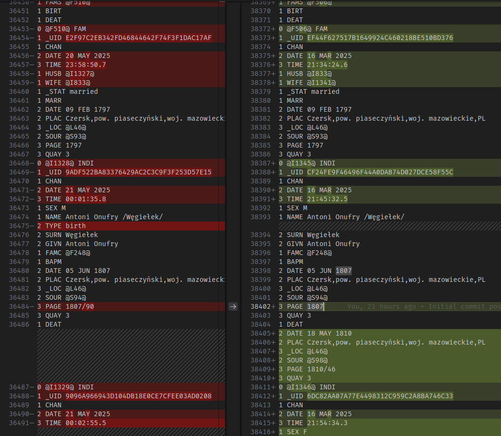

## How it started

Friday evening, the laptop screen shows a genealogical tree of your great-great-great-great...grandfather, a cold mug of beer (or a steaming cup of hot chocolate, no judgment) stands definitelly too close to the laptop, pure bliss. You save the file, close the windows, and suddenly realize that instead of working on the latest version of the tree from your USB drive, you've been working for weeks on an old version from your hard drive. A quick comparison – one has 200 more people, but there could be many more differences. What now?

## Why is this a problem? A few words about the GEDCOM format

GEDCOM is a file format that allows for the exchange of genealogical data between different programs. It is a text format that stores information about people, families, events, and relationships/references between them. Created by The Church of Jesus Christ of Latter-day Saints (Mormons) in the 1980s, it is now the de facto standard in genealogy, used by virtually all genealogy programs and websites. GEDCOM files have the `.ged` extension and are text files (human-readable), which makes them easy to edit and view, but also makes it easy to introduce errors.

Due to its simplicity, genealogy programs have a hard time detecting that two files contain the same people but in different versions. In practice, this means that no program can flawlessly merge two versions of the same tree, even though they can merge two trees into one (in this case with a huge number of duplicated people and events) and search for and merge potential duplicates – however, this can cause a lot of confusion and loss of information, and you can't be sure that all duplicates have been found.

## What exactly went wrong?

In my case, due to working on several computers, I kept the tree along with the source materials on each computer separately, and then copied them to the USB drive. Of course, it would have been better to always work only on the version from the USB drive or use the cloud, but... Actually, there is no "but". We’re wise after the event, as they say 😁

In my case, working independently on both files for 4 months led to new individuals and families being added in both files (mostly different in each one), as well as information being added about already existing people. This meant having to compare changes and manually decide which change in which version should be kept.

## Where to start

Let's start by checking how bad the situation is. A GEDCOM file has a defined structure, but the order of data and the object identifiers used (people, families, notes, sources, etc.) depend on the program being used. The program I used, [GEDKeeper](https://gedkeeper.net/), saves everything in the order of creation, which means that objects of different types (people, families, ...) are mixed with each other. This makes it very difficult to visualize differences in the files, because the tools for finding differences, not knowing the structure of the GEDCOM file, often show differences between different types of data.

So I started with some tidying up - I sorted the objects by type and identifier. GEDKeeper uses identifiers in the format `@AXXXX`, where `A` is a letter indicating the type of object (e.g., `I` for person, `F` for family), and `XXXX` is a serial number. This makes it easier to compare objects of the same type. It also makes it easier to distinguish where the modified objects end and new ones, not existing in the other file, begin.

Of course, I didn't do this manually, because manually moving a few to a dozen lines of text in a file containing over 40 thousand lines is suicide. I wrote a simple script in JavaScript that sorts the GEDCOM file by object type and identifier. This script can be run in Node.js, and its operation is simple - it reads the file, sorts the objects, and saves the result to a new file. As for the scripts presented here, I created them myself, but the methodology, problems, and ideas for their solutions were "discussed" with ChatGPT.

**WARNING: Before you start manually modifying GEDCOM files, it's a good idea to make a backup copy of them elsewhere. You can also create a local git repository in the folder with the tree and commit the current version of the tree - in the future, you can add separate commits after each batch of changes, which facilitates synchronization and tracking changes.**

<details>
<summary>The JS script I used to sort the GEDCOM file</summary>
```js
function sortFile(file) {
    const fs = require('node:fs');
    const path = require('node:path');
    const data = fs.readFileSync(file, 'utf8');
    const [header1, header2, ...rest] = data.split(/\r?\n/);
    const footer = rest.pop();

    const sorted = rest
        .map(line => [line.split(/\r?\n/)[0].split(' '), line])
        .map(([[_, id, type], item]) => ({ type, id, numId: +id.match(/\d+/g)[0], item }))
        .sort((a, b) => a.type.localeCompare(b.type) || a.numId - b.numId)
        .map(i => i.item);

    const finalContent = [header1, header2, ...sorted, footer].join('\r\n');
    
    const newName = path.basename(file, '.ged') + '-sorted.ged';
    const newPath = path.join(path.dirname(file), newName);
    fs.writeFileSync(newPath, sorted, 'utf8');
}
sortFile('/full/path/to/file-1.ged');
sortFile('/full/path/to/file-2.ged');
```
</details>

## Methodology and order of operations.

Having sorted the files contents, I could proceed to manually merge them.

I made all the changes in VSCode (Notepad++ would have worked too) with both GEDCOM files open side by side in a diff view. I always copied changes in both directions - my goal was to obtain two identical files containing all the changes - this way I would be able to confirm the successful merging of the files.

GEDKeeper saves the following types of objects in the GEDCOM file:
- People (identifier `@Ixxx@`, type `INDI`)
- Families (identifier `@Fxxx@`, type `FAM`)
- Notes (identifier `@Nxxx@`, type `NOTE`)
- Sources (identifier `@Sxxx@`, type `SOUR`)
- Multimedia (identifier `@Oxxx@`, type `OBJE`)
- Locations (identifier `@Lxxx@`, type `_LOC` - custom type used by GEDKeeper)

It is important to note that some of these objects may contain references to other objects, e.g., a person may reference a family (as a partner or as a child of their parents). Both people and families can refer to any other type in this way.

I started by merging the last 4 types - notes, sources, multimedia, and locations, which do not contain references to other objects. This was straightforward, as there were no changes to the notes and multimedia. In the case of locations and sources, a few new entries were created in both files. GEDKeeper uses consecutive numbers in the identifiers, which means that in both files, sources and locations with the same consecutive identifiers were created - so in one of the files, I just had to add 1000 to these numbers (changing, for example, `@L123` to `@L1123` - important: **throughout the entire file!**), and then copy the new entries from each of these files to the other.

While the general principle remained the same for people and families, it required a more detailed plan and checking of changes, due to the fact that people and families can contain multiple references at once and create very complex networks of references (family F1 references people I1, I2, I3, each of these people references F1, but also other families...).

<figure><figcaption>Chaos when comparing two GEDCOM files</figcaption></figure>


<details>
<summary>How references between people and families look in GEDCOM</summary>

People reference families in two ways:

```gedcom
0 @I1@ INDI
1 FAMC @F1@
1 FAMS @F2@
```

- FAMC - family F1 contains the parents (and siblings) of person I1.
- FAMS - family F2 contains the partner and children of person I1.

Both FAMC and FAMS can appear in a person zero, one, or multiple times.

Similarly, families reference people in several ways:

```gedcom
0 @F1@ FAM
1 WIFE @I1@
1 HUSB @I2@
1 CHIL @I3@
1 CHIL @I4@
1 CHIL @I5@
```

- WIFE and HUSB are respectively the wife (I1) and husband (I2); they can appear zero (when the partner is unknown) or one time.
- CHIL are the children of this family (here three children: I3, I4, and I5)
</details>

Two dog walks and one cup of coffee later, I came to the conclusion on how best to tackle this problem.

1. Merge changes in existing people (individuals common to both files), except for references to families (i.e., leaving differences in the FAMC and FAMS tags untouched).
2. In one of the files, for each new person (non-existent in the other file), increase the identifier by 10000 (throughout the entire file at once - replace all option)
3. Copy new people from each of these files to the other, but without copying references to families (because these identifiers may have collisions).
4. Merge changes in existing families (families common to both files), this time including individuals references.
5. In one of the files, for each new family (non-existent in the other file), increase the identifier by 1000 (again throughout the entire file at once)
6. Copy new families from each of these files to the other
7. Finish merging changes from step 1 by copying the rest of the differences in people (i.e., references to families) from each of these files to the other.

In the last step, if a conflict arises (e.g., the same person in one file points to a different family than in the other), it would indicate a duplication of the family (one family added twice). Similarly, in the case of a conflict with people indicated in the family, it may indicate a duplication of the person (mainly in the case of a partner).

## After completing all the steps 

This whole process took two long weekend evenings. As a result, I obtained two identical GEDCOM files. However, this did not yet mean the end of the fun - such a file had to be opened correctly in the genealogy program (without any errors). However, I decided to make one manual verification before running GedKeeper. I thought it was necessary to check the correctness of the references - that the families indicated by the people exist, that the people indicated by the families exist, and that families and people correctly reference each other. Again, I used the nodeJS script for this

<details>
<summary>The JS script I used to verify references in the GEDCOM file</summary>
```js
function checkCrossReferences(file) {
    let readErrs = 0, refErrs = 0;

    const fs = require('node:fs');
    const data = fs.readFileSync(file, 'utf8');
    const { INDI, FAM } = data
        .split(/\r?\n(?=0 )/g)
        .map(line => [line.split(/\r?\n/)[0].split(' '), line])
        .map(([[_, id, type], item]) => ({ type, id, item: /** @type {string} */(item) }))
        .reduce(
            (acc, { type, id, item }) => {
                if (!(type === 'INDI' || type === 'FAM')) {
                    return acc;
                }
                acc[type][id] = { item, references: [] };
                const references = acc[type][id].references;
                switch (type) {
                    case 'INDI': {
                        const matches = item.match(/^1 FAM[CS] @F(\d+)@$/mg);
                        if (matches) {
                            matches.forEach(match => {
                                const [_, type, id] = match.split(' ');
                                if (references.some(ref => ref.id === id)) {
                                    console.error(`Duplicate reference found for INDIVIDUAL ${id} in FAMILY ${type}.`);
                                    readErrs++;
                                }
                                references.push({ type, id });
                            });
                        }
                        break;
                    }
                    case 'FAM': {
                        const matches = item.match(/^1 (HUSB|WIFE|CHIL) @I(\d+)@$/mg);
                        if (matches) {
                            matches.forEach(match => {
                                const [_, type, id] = match.split(' ');
                                if (references.some(ref => ref.id === id)) {
                                    console.error(`Duplicate reference found for FAMILY ${id} in INDIVIDUAL ${type}.`);
                                    readErrs++;
                                }
                                references.push({ type, id });
                            });
                        }
                        break;
                    }
                }
                return acc;
            },
            { INDI: {}, FAM: {} }
        );

    for(const id in INDI) {
        const indi = INDI[id];
        indi.references.forEach(ref => {
            if (!FAM[ref.id]) {
                console.error(`Cross-reference error: INDIVIDUAL ${id} references non-existent FAMILY ${ref.id}.`);
                refErrs++;
            } else {
                const crossRefs = FAM[ref.id].references.filter(r => r.id === id);
                if (crossRefs.length === 0) {
                    console.error(`Cross-reference error: FAMILY ${ref.id} does not reference INDIVIDUAL ${id}.`);
                    refErrs++;
                } else if (crossRefs.length > 1) {
                    console.error(`Cross-reference error: FAMILY ${ref.id} references INDIVIDUAL ${id} multiple times.`, crossRefs);
                    refErrs++;
                }
            }
        });
    }
    for(const id in FAM) {
        const fam = FAM[id];
        fam.references.forEach(ref => {
            if (!INDI[ref.id]) {
                console.error(`Cross-reference error: FAMILY ${id} references non-existent INDIVIDUAL ${ref.id}.`);
                refErrs++;
            } else {
                const crossRefs = INDI[ref.id].references.filter(r => r.id === id);
                if (crossRefs.length === 0) {
                    console.error(`Cross-reference error: INDIVIDUAL ${ref.id} does not reference FAMILY ${id}.`);
                    refErrs++;
                } else if (crossRefs.length > 1) {
                    console.error(`Cross-reference error: INDIVIDUAL ${ref.id} references FAMILY ${id} multiple times.`, crossRefs);
                    refErrs++;
                }
            }
        });
    }

    console.log(`\nFINAL REPORT for file ${file}:`);
    console.log(`Checked ${Object.keys(INDI).length} individuals and ${Object.keys(FAM).length} families.`);
    console.log(`Read errors: ${readErrs}`);
    console.log(`Cross-reference errors: ${refErrs}`);
}
checkCrossReferences('/full/path/to/file-1.ged');
checkCrossReferences('/full/path/to/file-2.ged');
```
</details>

## Lessons for the future:

1. Work only on one main copy of the tree and sync it immediately after work is done
2. Keep tree in a git repository to keep the history of changes of the family tree
3. If using nodeJS to work with GEDCOM files seems stupid, but it works, then it's not stupid
