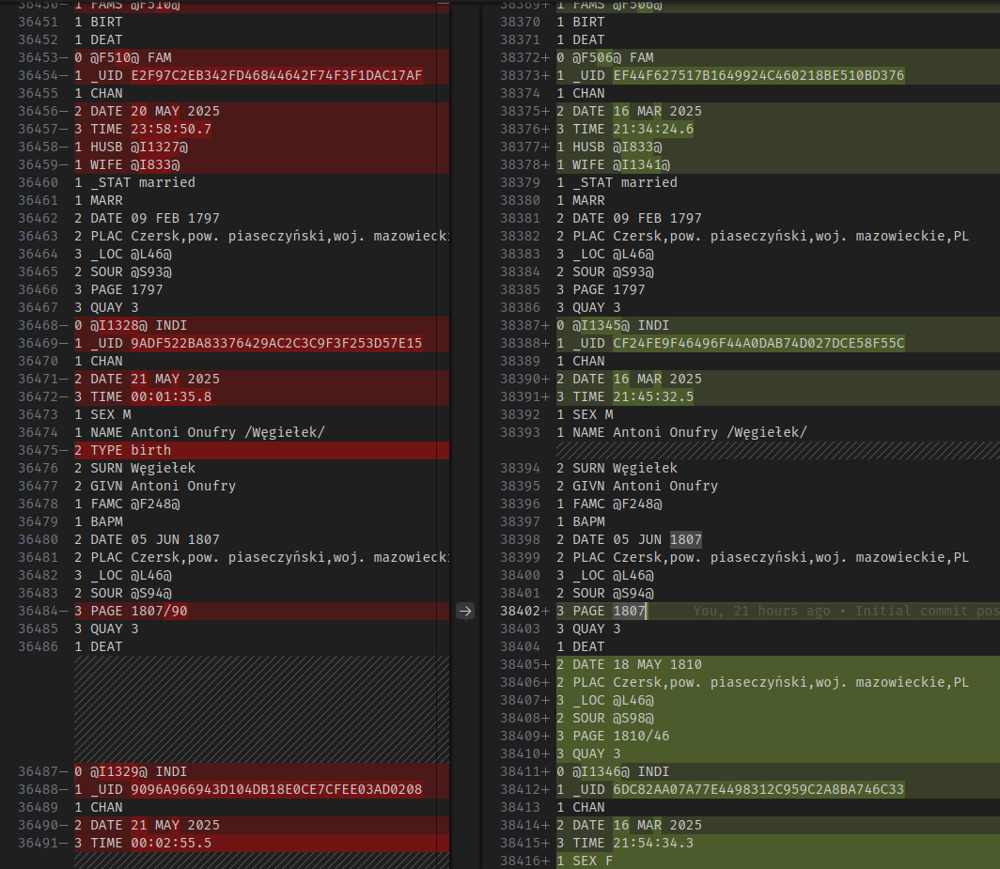

## Jak to się zaczęło

Piątek wieczór, na ekranie laptopa widać drzewo genealogiczne prapraprapra...dziadka, obok, zdecydowanie za blisko laptopa stoi zimny kufel piwa (albo parujący kubek gorącej czekolady, nie oceniam), istna sielanka. Zapisujesz plik, zamykasz okna i nagle orientujesz się, że zamiast na najnowszej wersji drzewa z pendrive'a, od kilku tygodni pracujesz na starej wersji z dysku twardego. Szybkie porównanie - w jednym 200 osób więcej, ale przecież różnic może być znacznie więcej. Jak do tego doszło? https://youtu.be/_1jxykAEjuY 🙃

## Dlaczego to problem czyli kilka słów o formacie GEDCOM

GEDCOM to format plików, który pozwala na wymianę danych genealogicznych pomiędzy różnymi programami. Jest to format tekstowy, który przechowuje informacje o osobach, rodzinach, wydarzeniach i relacjach między nimi. Stworzony przez Kościół Jezusa Chrystusa Świętych w Dniach Ostatnich (Mormonów) w latach 80-tych XX wieku, jest obecnie de-facto standardem w genealogii, na którym opierają się praktycznie wszystkie programy i witryny genealogiczne. Pliki GEDCOM mają rozszerzenie `.ged` i są formatem tekstowym (czytelne dla ludzi), co ułatwia ich edycję i przeglądanie, ale też umożliwia łatwe wprowadzanie błędów.

Ze względu na swoją prostotę, programom genealogicznym cięzko jest wykryć, że dwa pliki zawierają te same osoby, ale w różnych wersjach. W praktyce oznacza to, że żaden program nie potrafi bezbłędnie połączyć dwóch wersji tego samego drzewa, mimo że potrafią połączyć dwa drzewa w jedno (w tym przypadku z olbrzymią liczbą zduplikowanych osób i wydarzeń) oraz wyszukać i połączyć potencjalne duplikaty - jednak można w ten sposób sporo namieszać i stracić część informacji, a w dodatku nie mieć pewności, że wszystkie duplikaty zostały znalezione.

## Co dokładnie poszło nie tak?

W moim przypadku, ze względu na pracę na kilku komputerach, trzymałem drzewo wraz z materiałami źródłowymi na każdym komputerze osobno, a następnie kopiowałem je na pendrive'a. Oczywiście lepiej byłoby pracować zawsze tylko na wersji z pendrive'a lub używać chmury, ale... W sumie nie ma ale. Mądry Polak po szkodzie jak to mówią 😁

W moim przypadku praca nad oboma plikami niezależnie trwała 4 miesiące; w obu plikach pojawiały się nowe osoby i rodziny, a także dodawane były informacje o istniejących już osobach. Oznaczało to konieczność porównania zmian i ręcznego zdecydowania która zmiana w której wersji powinna zostać.

## Od czego zacząć

Zacznijmy od sprawdzenia jak bardzo jest źle. Plik GEDCOM ma określoną strukturę, ale kolejność danych oraz stosowane identyfikatory obiektów (osób, rodzin, notatek, źródeł, itd) zależy od używanego programu. Używany przeze mnie [GEDKeeper](https://gedkeeper.net/) zapisuje wszystko w kolejności stworzenia, co oznacza że obiekty różnych typów (osoby, rodziny, ...) są ze sobą wymieszane. To bardzo utrudnia wizualizację różnic w plikach, bo narzędzia to szukania różnic, nie znając struktury pliku GEDCOM, pokazują często różnice między różnymi typami danych.

Zacząłem więc od drobnych porządków - posortowałem obiekty po typie i identyfikatorze. GEDKeeper stosuje identyfikatory w formacie `@AXXXX`, gdzie `A` to litera oznaczająca typ obiektu (np. `I` dla osoby, `F` dla rodziny), a `XXXX` to numer porządkowy. Dzięki temu łatwiej jest porównywać obiekty tego samego typu. Łatwiej także rozróżnić gdzie kończą się obiekty zmieniane a zaczynają nowe, nie istniejące w drugim pliku.

Oczywiście nie robiłem tego ręcznie, bo ręczne przenoszenie po kilka–kilkanaście linii tekstu w pliku zawierającym ich ponad 40 tysięcy to samobójstwo. Napisałem prosty skrypt w JavaScript, który sortuje plik GEDCOM według typu obiektu i identyfikatora. Skrypt ten można uruchomić w Node.js, a jego działanie jest proste - odczytuje plik, sortuje obiekty i zapisuje wynik do nowego pliku. O ile przedstawione tu skrypty tworzyłem sam, o tyle metodykę, problemy i pomysły na ich rozwiązanie "omawiałem" z ChatGPT.

**UWAGA: Przed przystąpieniem do ręcznego modyfikowania plików GEDCOM warto zrobić ich kopię zapasową w innym miejscu. Można także stworzyć lokalne repozytorium git w folderze z drzewem i zacommitować aktualną wersję drzewa - w przyszłości można dodawać osobne commity po każdej partii zmian, co ułatwia synchronizację i prześledzenie zmian.**

<details>
<summary>Użyty przeze mnie skrypt JS do sortowania pliku GEDCOM</summary>
```js
function sortFile(file) {
    const fs = require('node:fs');
    const path = require('node:path');
    const data = fs.readFileSync(file, 'utf8');
    const [header1, header2, ...rest] = data.split(/\r?\n/);
    const footer = rest.pop();

    const sorted = rest
        .map(line => [line.split(/\r?\n/)[0].split(' '), line])
        .map(([[_, id, type], item]) => ({ type, id, numId: +id.match(/\d+/g)[0], item }))
        .sort((a, b) => a.type.localeCompare(b.type) || a.numId - b.numId)
        .map(i => i.item);

    const finalContent = [header1, header2, ...sorted, footer].join('\r\n');
    
    const newName = path.basename(file, '.ged') + '-sorted.ged';
    const newPath = path.join(path.dirname(file), newName);
    fs.writeFileSync(newPath, sorted, 'utf8');
}
sortFile('/full/path/to/file-1.ged');
sortFile('/full/path/to/file-2.ged');
```
</details>

## Metodyka i kolejność działania.

Mając posortowane pliki, mogłem przystąpić do ręcznego ich łączenia.

Wszystkie zmiany wykonywałem w VSCode (Notepad++ też by zadziałał) mając otworzone oba pliki GEDCOM jeden obok drugiego w widoku wyróżniania różnic. Zmiany kopiowałem zawsze w obie strony - moim celem było uzyskanie dwóch identycznych plików zawierających wszystkie zmiany - w ten sposób byłbym w stanie potwierdzić skuteczne połączenie plików.

GEDKeeper zapisuje następujące typy obiektów w pliku GEDCOM:
- Osoby (identyfikator `@Ixxx@`, typ `INDI`)
- Rodziny (identyfikator `@Fxxx@`, typ `FAM`)
- Notatki (identyfikator `@Nxxx@`, typ `NOTE`)
- Źródła (identyfikator `@Sxxx@`, typ `SOUR`)
- Multimedia (identyfikator `@Oxxx@`, typ `OBJE`)
- Lokalizacje (identyfikator `@Lxxx@`, typ `_LOC` - typ niestandardowy używany przez GEDKeeper)

Istotne jest to, że niektóre z tych obiektów mogą zawierać identyfikatory innych obiektów, np. osoba może mieć referencje do rodziny (swojej jako partner lub swoich rodziców jako dziecko). Zarówno osoby jak i rodziny mogą się odnosić w ten sposób do każdego innego typu.

Zacząłem od łączenia 4 ostatnich typów, czyli notatek, źródeł, multimediów i lokalizacji, które nie zawierają referencji do innych obiektów. Było to proste, gdyż nie było żadnych zmian notatek i multimediów. W przypadku lokalizacji i źródeł, w obu plikach powstało po kilka nowych wpisów. GEDKeeper stosuje kolejne liczby w identyfikatorach, co oznacza że w obu plikach powstawały źródła i lokalizacje z tymi samymi kolejnymi identyfikatorami - wystarczyło więc w jednym z plików dodać do tych numerów 1000 (zmieniając np. `@L123` na `@L1123` - ważne: **w całym pliku!**), a następnie skopiować nowe wpisy z każdego z tych plików do drugiego.

O ile ogólna zasada pozostawała taka sama dla osób i rodzin, o tyle wymagała ona dokładniejszego planu i sprawdzania zmian, ze względu na to, że osoby i rodziny mogą zawierać wiele referencji na raz i tworzyć bardzo skomplikowane siatki odniesień (rodzina F1 ma odniesienie do osób I1, I2, I3, każda z tych osób zawiera odniesienie do F1, ale także i innych rodzin...).

<figure>

<figcaption>Chaos przy porównywaniu dwóch plików GEDCOM</figcaption>
</figure>


<details>
<summary>Jak wyglądają odniesienia między osobami i rodzinami w GEDCOM</summary>

Osoby wskazują rodziny na dwa sposoby:

```gedcom
0 @I1@ INDI
1 FAMC @F1@
1 FAMS @F2@
```

- FAMC - rodzina F1 zawiera rodziców (i rodzeństwo) osoby I1.
- FAMS - rodzina F2 zawiera partnera i dzieci osoby I1.

Zarówno FAMC jak i FAMS mogą pojawić się w danej osobie zero, jeden lub więcej razy.

Analogicznie, rodziny wskazują osoby na kilka sposobów:

```gedcom
0 @F1@ FAM
1 WIFE @I1@
1 HUSB @I2@
1 CHIL @I3@
1 CHIL @I4@
1 CHIL @I5@
```

- WIFE i HUSB to odpowiednio żona (I1) i mąż (I2); mogą się pojawić zero (gdy partner jest nieznany) lub jeden raz.
- CHIL to dzieci tej rodziny (tu trójka dzieci: I3, I4 i I5)
</details>

Dwa spacery z psem i jeden kubek kawy później, doszedłem do wniosku jak najlepiej wziąć się za ten problem.

1. Połączyć zmiany w istniejących osobach, ale nie kopiując jeszcze odniesień do rodzin (czyli pozostawiając różnice w tagach FAMC i FAMS nietknięte).
2. W jednym z plików dla każdej nowej osoby zwiększyć identyfikator o 10000 (w całym pliku na raz - opcja Zamień wszystko)
3. Przekopiować nowe osoby z każdego z tych plików do drugiego, ale bez kopiowania odniesień do rodzin (bo te identyfikatory mogą mieć kolizje).
4. Połączyć zmiany w istniejących rodzinach.
5. W jednym z plików dla każdej nowej rodziny zwiększyć identyfikator o 1000 (ponownie w całym pliku na raz)
6. Przekopiować nowe rodziny z każdego z tych plików do drugiego
7. Przekopiować resztę różnic w osobach (czyli odniesienia do rodzin) z każdego z tych plików do drugiego.

W ostatnim kroku, jeśli pojawiłby się konflikt (np ta sama osoba w jednym pliku wskazuje na inną rodzinę niż w drugim), oznaczałoby to duplikację rodziny (jedna rodzina dodana dwa razy). Analogicznie w przypadku konfliktu z osobami wskazanymi w rodzinie może to oznaczać duplikację osoby (głównie w przypadku partnera).

## Po zakończeniu wszystkich kroków 

Cała ta zabawa zajęła dwa długie weekendowe wieczory. W jej wyniku uzyskałem dwa identyczne pliki GEDCOM. To jeszcze nie oznaczało skończonej zabawy - taki plik musiał się poprawnie otworzyć w programie genealogicznym (bez żadnych błędów). Postanowiłem jednak dokonać jednej ręcznej weryfikacji przed uruchamianiem GedKeepera. Uznałem, że należy sprawdzić poprawność odniesień - że wskazywane przez osoby rodziny istnieją, że osoby wskazywane przez rodziny istnieją, oraz że rodziny i osoby prawidłowo wskazują na siebie nawzajem. Ponownie użyłem do tego skryptu nodeJS

<details>
<summary>Użyty przeze mnie skrypt JS do weryfikacji odniesień w pliku GEDCOM</summary>
```js
function checkCrossReferences(file) {
    let readErrs = 0, refErrs = 0;

    const fs = require('node:fs');
    const data = fs.readFileSync(file, 'utf8');
    const { INDI, FAM } = data
        .split(/\r?\n(?=0 )/g)
        .map(line => [line.split(/\r?\n/)[0].split(' '), line])
        .map(([[_, id, type], item]) => ({ type, id, item: /** @type {string} */(item) }))
        .reduce(
            (acc, { type, id, item }) => {
                if (!(type === 'INDI' || type === 'FAM')) {
                    return acc;
                }
                acc[type][id] = { item, references: [] };
                const references = acc[type][id].references;
                switch (type) {
                    case 'INDI': {
                        const matches = item.match(/^1 FAM[CS] @F(\d+)@$/mg);
                        if (matches) {
                            matches.forEach(match => {
                                const [_, type, id] = match.split(' ');
                                if (references.some(ref => ref.id === id)) {
                                    console.error(`Duplicate reference found for INDIVIDUAL ${id} in FAMILY ${type}.`);
                                    readErrs++;
                                }
                                references.push({ type, id });
                            });
                        }
                        break;
                    }
                    case 'FAM': {
                        const matches = item.match(/^1 (HUSB|WIFE|CHIL) @I(\d+)@$/mg);
                        if (matches) {
                            matches.forEach(match => {
                                const [_, type, id] = match.split(' ');
                                if (references.some(ref => ref.id === id)) {
                                    console.error(`Duplicate reference found for FAMILY ${id} in INDIVIDUAL ${type}.`);
                                    readErrs++;
                                }
                                references.push({ type, id });
                            });
                        }
                        break;
                    }
                }
                return acc;
            },
            { INDI: {}, FAM: {} }
        );

    for(const id in INDI) {
        const indi = INDI[id];
        indi.references.forEach(ref => {
            if (!FAM[ref.id]) {
                console.error(`Cross-reference error: INDIVIDUAL ${id} references non-existent FAMILY ${ref.id}.`);
                refErrs++;
            } else {
                const crossRefs = FAM[ref.id].references.filter(r => r.id === id);
                if (crossRefs.length === 0) {
                    console.error(`Cross-reference error: FAMILY ${ref.id} does not reference INDIVIDUAL ${id}.`);
                    refErrs++;
                } else if (crossRefs.length > 1) {
                    console.error(`Cross-reference error: FAMILY ${ref.id} references INDIVIDUAL ${id} multiple times.`, crossRefs);
                    refErrs++;
                }
            }
        });
    }
    for(const id in FAM) {
        const fam = FAM[id];
        fam.references.forEach(ref => {
            if (!INDI[ref.id]) {
                console.error(`Cross-reference error: FAMILY ${id} references non-existent INDIVIDUAL ${ref.id}.`);
                refErrs++;
            } else {
                const crossRefs = INDI[ref.id].references.filter(r => r.id === id);
                if (crossRefs.length === 0) {
                    console.error(`Cross-reference error: INDIVIDUAL ${ref.id} does not reference FAMILY ${id}.`);
                    refErrs++;
                } else if (crossRefs.length > 1) {
                    console.error(`Cross-reference error: INDIVIDUAL ${ref.id} references FAMILY ${id} multiple times.`, crossRefs);
                    refErrs++;
                }
            }
        });
    }

    console.log(`\nFINAL REPORT for file ${file}:`);
    console.log(`Checked ${Object.keys(INDI).length} individuals and ${Object.keys(FAM).length} families.`);
    console.log(`Read errors: ${readErrs}`);
    console.log(`Cross-reference errors: ${refErrs}`);
}
checkCrossReferences('/full/path/to/file-1.ged');
checkCrossReferences('/full/path/to/file-2.ged');
```
</details>

## Nauczka na przyszłość:

1. Pracuj tylko na jednej głównej kopii drzewa i synchronizuj ją od razu po zakończeniu pracy
2. Przechowuj drzewo w repozytorium git, aby mieć historię zmian drzewa genealogicznego
3. Jeśli używanie nodeJS do pracy z plikami GEDCOM wydaje się głupie, ale działa, to znaczy że nie jest głupie
